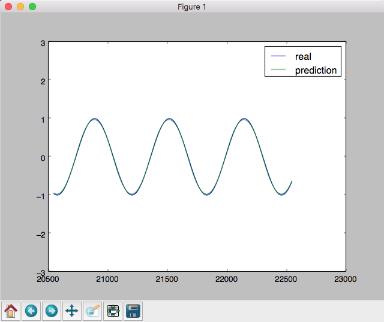
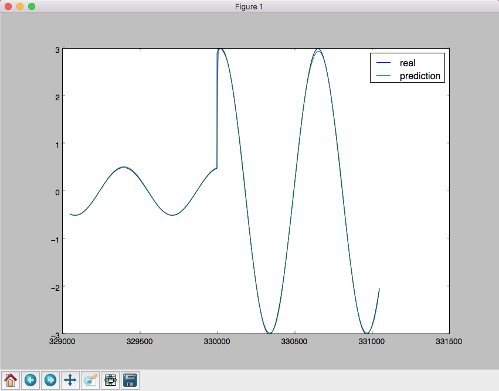

# 基于LSTM的简易请求量预测模型

  说明： 主要是学习LSTM的应用

  http://colah.github.io/posts/2015-08-Understanding-LSTMs/


## 模型

```
    with tf.variable_scope("input"):
            self.x = tf.placeholder(tf.float32, shape=[None, self.time_step, self.input_dim], name="x")
            self.y = tf.placeholder(tf.float32, shape=[None, self.output_dim], name="y")
            self.x_index = tf.placeholder(tf.float32, shape=[None, 1], name="x_index")
        with tf.variable_scope("lstm"):
            cell = tf.nn.rnn_cell.LSTMCell(self.lstm_hidden_units, state_is_tuple=True, name="lstm_cell")
            out, state = tf.nn.dynamic_rnn(cell, self.x, dtype=tf.float32)
            out = tf.transpose(out, [1, 0, 2])
            lstm_out = tf.gather(out, int(out.get_shape()[0]) - 1, name="lstm_out")
        lstm_prediction = tf.layers.dense(lstm_out, self.output_dim, activation=tf.tanh, name="lstm_prediction")

        with tf.variable_scope("vocation_dense"):
            l_1 = tf.layers.dense(self.x_index, 32, activation=tf.nn.relu, name="x_index_relu")
            l_1 = tf.layers.dense(l_1, 1, activation=tf.nn.tanh, name="x_index_tanh")
            self.y_prediction = l_1 * 10 * lstm_prediction

```

## 使用sin模拟正常访问

  

## 模拟节假日整体幅度大调整

  
